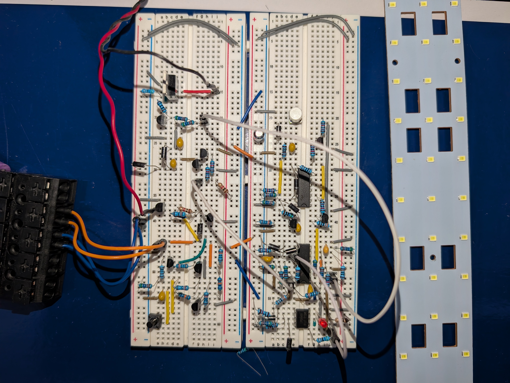

# Lipo-Powered Analog LED Driver (on-going project)
This circuit uses only ICs and discrete components to control the dimming of an LED bar. No microcontroller is involved.

[schematic](schematic.pdf)

## Features:

### Voltage Doubler:
The circuit incorporates a voltage multiplier that boosts the LiPo battery voltage to nearly twice its original level. This ensures the voltage driving the N-channel MOSFET gate is higher than the gate-source threshold voltage, even as the battery voltage decreases over time.

### PWM Generator:
An LM339 Voltage Comparator is used to generate a square wave. The square wave is then converted into a semi-ramp waveform and fed to a second voltage comparator to be compared with a variable DC voltage. The output is a square wave with a controllable duty cycle, which drives the MOSFET gate.

### Duty Cycle Selector
The circuit includes a resistor selector, allowing the user to switch between three preset duty cycles, thus providing different brightness modes.

Why not use a potentiometer?
While a potentiometer would simplify the design greatly and provide continuous dimming control, I opted to use the resistor selector because I wanted to explore a variety of ICs and different circuit designs. 

## Prototype

