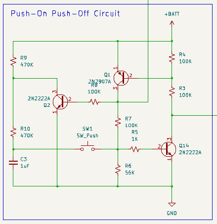
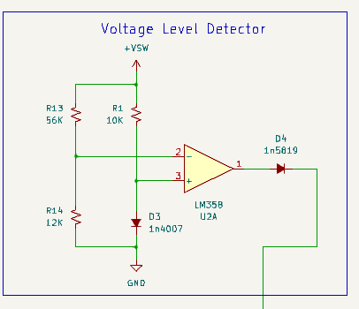
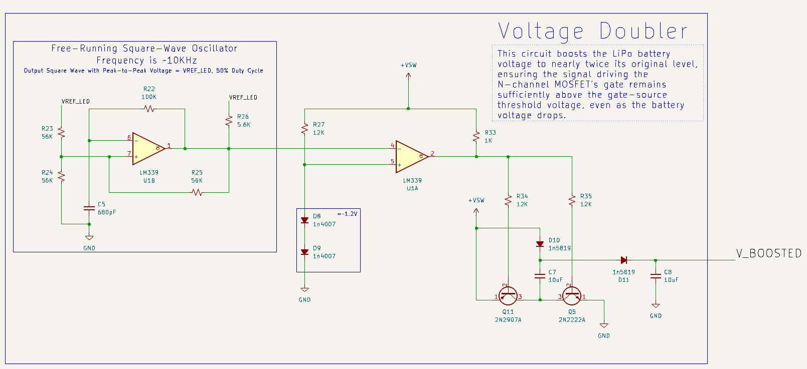
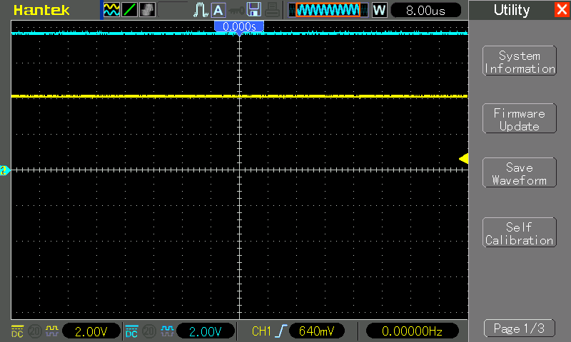
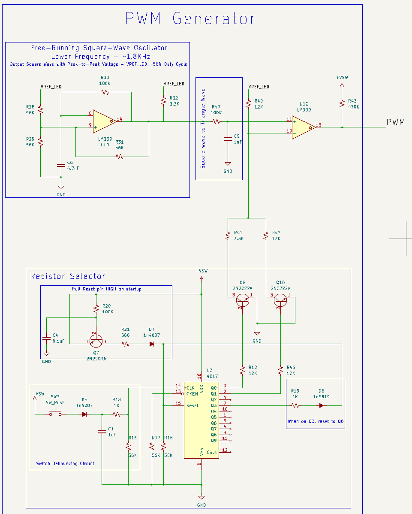
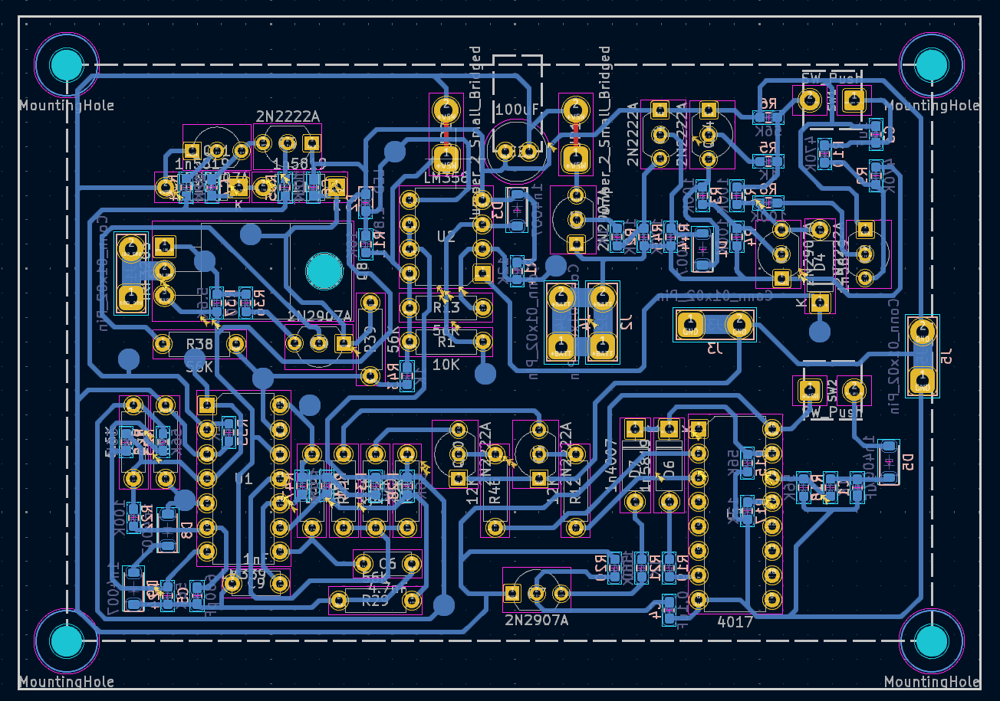
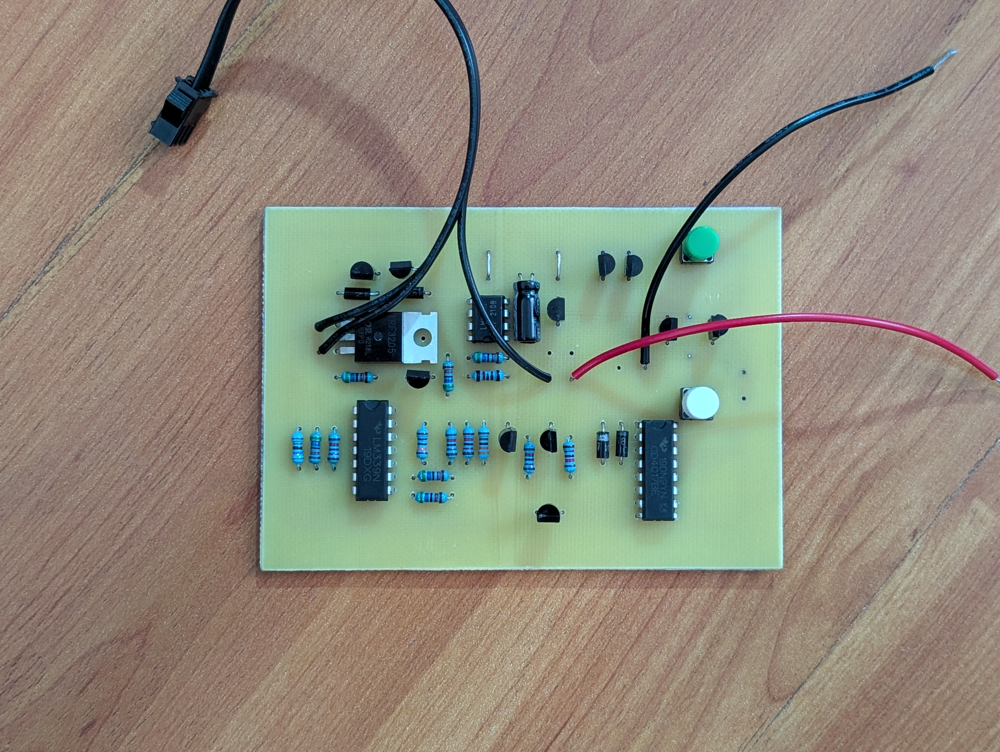
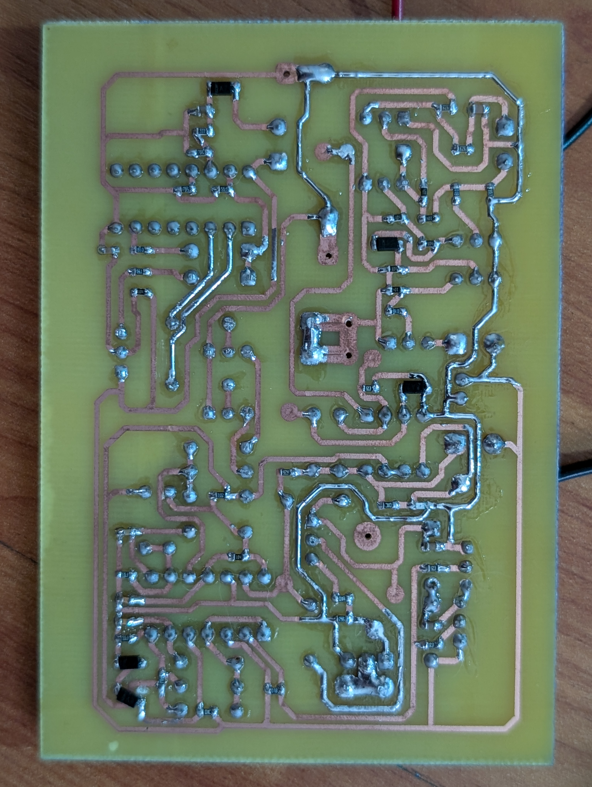

# Lipo-Powered Analog LED Driver
This circuit controls the dimming of an LED bar using only ICs and analog components&mdash;no microcontroller required. [Watch the demo here](https://youtu.be/S3qqzCgYGNY)

## [Click Me for Schematic](KiCad/schematic.pdf)

### Toggle ON/OFF
The circuit uses a push button to toggle power ON and OFF. In the OFF state, it consumes approximately 150 µA, due to current leakage through pull-up resistors.  

### Automatic Power Down
The circuit automatically shuts down when the voltage drops to 3V. However, even in the OFF state, it still consumes 150 µA, so it does not protect the battery from discharging comepletely.  

### Driving the LED with an N-Channel MOSFET
***Voltage Doubler***: The mosfet I'm using is a N-Channel MOSFET [IRF3205](https://www.infineon.com/dgdl/Infineon-IRF3205-DataSheet-v01_01-EN.pdf?fileId=5546d462533600a4015355def244190a). It has a Gate Threshold Voltage (Vgs) ranging from 2.0V to 4.0V. The normal operating voltage of a LiPo 18650 battery is 3.7V, and it decreases as the battery is being depleted. The solution is to have a voltage multiplier circuit to boost the voltage seen by the mosfet's gate to nearly twice the battery's voltage. This ensures the voltage driving the mosfet is always higher than the gate-source threshold voltage, even as the battery voltage decreases over time.  
  

The yellow trace shows the battery voltage (~4V). The blue trace shows the boosted voltage (~8V).  
  
  
***PWM Generator for Mosfet***:  
* A LM339 voltage comparator generates a ~800Hz square wave.
* This signal passes through a low-pass filter, converting it into a (somewhat) triangular waveform.
* A second voltage comparator compares this triangular waveform with a variable DC reference voltage (generated by a Resistor Selector Circuit).
* The result is a PWM signal with a controllable duty cycle, which drives the MOSFET gate and controls LED brightness.
  

Below is an example of a 25% duty cycle PWM signal:
* Top image: Triangular wave (yellow) vs. DC reference voltage (blue). Adjusting the level of the DC reference votlage will vary the duty cycle of the output square wave.
* Bottom image: Resulting gate drive signal (blue) (~8V amplitude).  
  
  
The circuit also allows a gradual voltage fall at the MOSFET gate, preventing high reverse voltage spikes at the drain (caused by long wiring acting as an inductor).

## Prototype

## PCB Layout
***The PCB layout was designed for homemade single-sided PCB fabrication using [this PCB plotter attachment](https://github.com/furpectfox/PCB_Trace_Plotter)***  

## Finish

